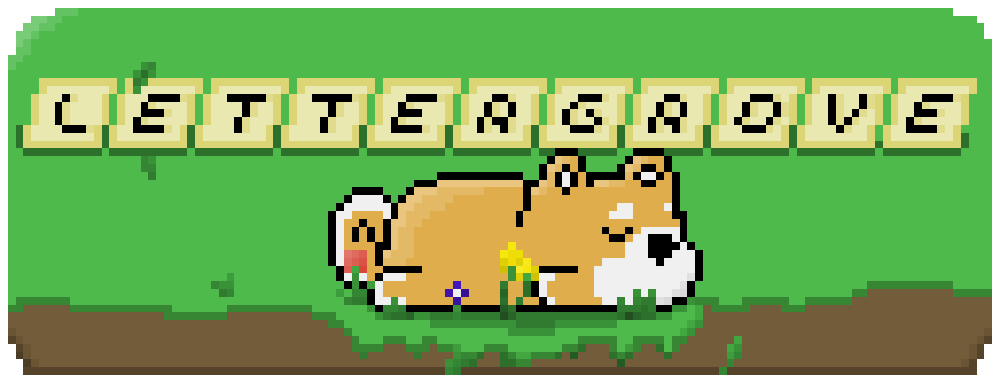

## [Play LetterGrove here!](lettergrove.onrender.com)

## Weblab 2025

### Team CTM:

- Leon Chen
- Thomas Cong
- Steve Zhang

### Info

LetterGrove is a multiplayer word game, designed to remind players of comforting experiences. We drew inspiration from existing word games but sought to make them more multiplayer. The creative direction was largely guided by classic comforting games like Stardew Valley and Animal Crossing.

This project was coded over the course of MIT IAP 2025 (approx. 4 weeks), where we handled both frontend and backend design and development. The frontend uses the React framework. We are using MongoDB as the database for the backend, and Express as the handler. In general, all of the code is using the MERN stack. No external packages or libraries were used, other than handling Google Account Authentication.

The art and music for LetterGrove were also drawn during this period.

### Acknowledgements

Thank you to the WebLab staff for putting together such a complete course!
